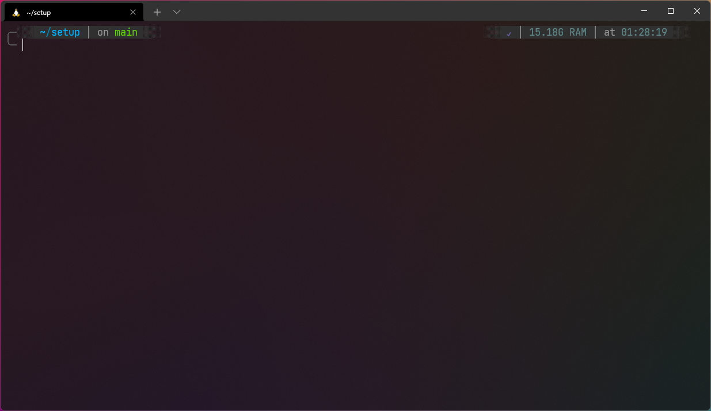

# setup
These are my setup to have more productity while coding applications (there is a installation script bonus).

### General preferences
- Theme: [Tokyo Night](https://marketplace.visualstudio.com/items?itemName=enkia.tokyo-night)
- Font: [Cascadia Code](https://github.com/microsoft/cascadia-code)

### Tools
- [Visual Studio Code](https://code.visualstudio.com/)
- [Azure Data Studio](https://docs.microsoft.com/en-us/sql/azure-data-studio/download-azure-data-studio?view=sql-server-ver15)
- GitHub — you're here
- Windows 10
- [WSL2](https://docs.microsoft.com/en-us/windows/wsl/install) [(Ubuntu 20.04)](https://www.microsoft.com/store/productId/9NBLGGH4MSV6)

### Wallpaper

### Terminal visual

